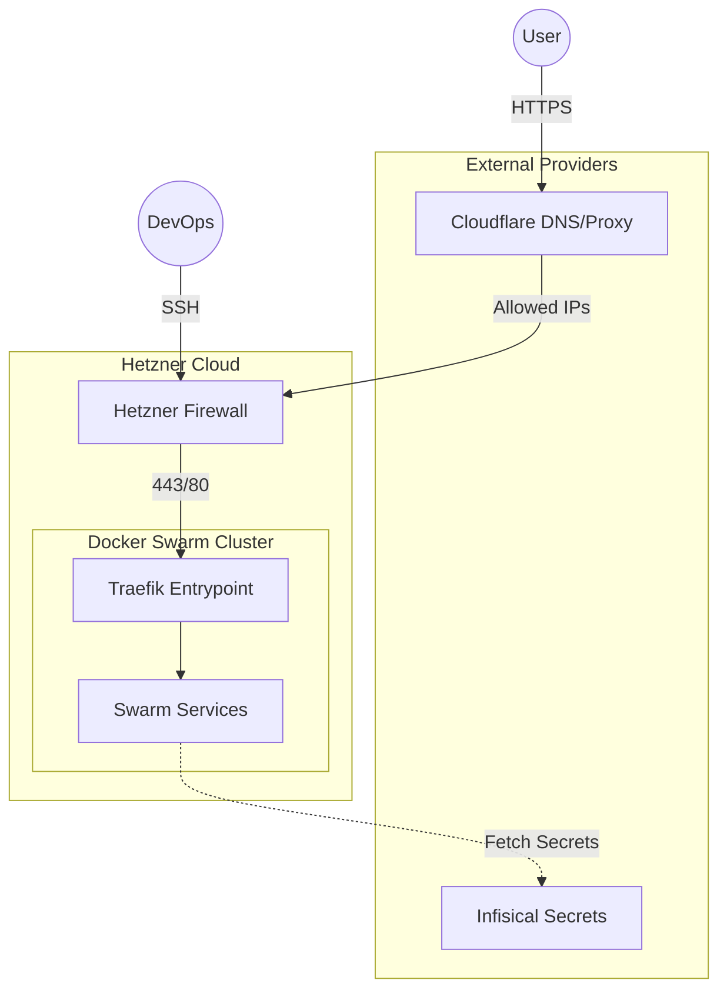
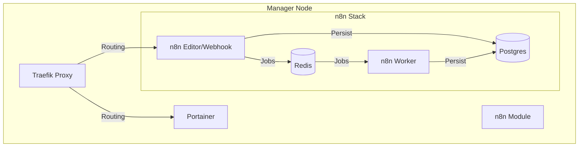

# n8n Infrastructure - Hetzner Cloud

Infrastructure as code for deploying n8n on Hetzner Cloud using Terraform, Docker Swarm, and Portainer.

## 🎯 What is this project?

Complete and production-ready infrastructure for self-hosting n8n with:
- ✅ **Everything in containers** (PostgreSQL, Redis, n8n)
- ✅ **Docker Swarm** for orchestration
- ✅ **Portainer** for UI-based management
- ✅ **High Availability Ready**
- ✅ **Hardened Security** from day 1
- ✅ **Complete Documentation**

### 🧩 Context Diagram



### 🏗️ High-Level Architecture



---

## 📚 Documentation (Living Docs)

This project maintains a concise set of "Living Documents" to ensure technical clarity without redundancy.

1. **[ARCHITECTURE.md](docs/ARCHITECTURE.md)** 📋
   - **System Design**: Full architecture, network topology, and request flows.
   - **Design Rationale**: Why we chose Swarm, Infisical, and Traefik.
   - **Security Deep-Dive**: Defense-in-depth, ZTNA, and auditing policies.
   - **Resource Allocation**: CPU/Memory limits per service.

2. **[TROUBLESHOOTING.md](docs/TROUBLESHOOTING.md)** 🛠️
   - **Common Issues**: 10 cases of infrastructure and stack errors.
   - **Diagnostics**: Logs and command-based debugging.

3. **[Architecture Decisions (ADRs)](docs/adr/)** 🏛️
   - Historical record of critical design choices.

---

## 🚀 Quick Start

### 1. Initial Setup
```bash
# Clone and enter the project
git clone <repository-url>
cd n8n-infrastructure

# 🚀 Populate your .env file
# Requests Infisical Machine Identity and R2 Credentials
./scripts/setup-env.sh
```

### 2. Secret Mapping (Infisical Vault)
Terraform fetches secrets using the following folder structure. Ensure these exist in your project:

- **Folder: `/` (Root)**
  - `TRAEFIK_WEB_PASSWORD`: Basic Auth for Traefik dashboard.
- **Folder: `/HETZNER`**
  - `HETZNER_TERRAFORM_API_KEY`: API token for provisioning servers.
- **Folder: `/CLOUDFLARE`**
  - `CLOUDFLARE_TERRAFORM_API_TOKEN`: API token for DNS and Access.
  - `CLOUDFLARE_EMAIL`: Admin email for Cloudflare.
- **Folder: `/n8n`**
  - `N8N_ENCRYPTION_KEY`: Master key for credential encryption.
  - `POSTGRES_PASSWORD`: Database password.
  - `REDIS_PASSWORD`: Queue password.
- **Folder: `/SMTP`**
  - `UMBLER_SMTP_USER`: SMTP username.
  - `UMBLER_SMTP_PASSWORD`: SMTP password.

### 3. Deploy
```bash
cd terraform
# Load .env (includes Infisical Client Secret)
export $(grep -v '^#' ../.env | xargs)

terraform init
terraform apply
```

---

## 🏗️ Project Structure
```text
.
├── docs/               # 📋 Documentation (Design/Security) & DEPLOYMENT (Ops)
├── terraform/          # 🏗️ IaC: Network, Firewalls, Nodes, and Stack Automation
├── services/           # 🐋 Docker Swarm Stack Definitions (Compose files)
├── scripts/            # 🔧 Utility scripts for bootstrapping and maintenance
├── ssh-keys/           # 🔑 Generated SSH keys (Gitignored)
├── CHANGELOG.md        # 📝 Version history
└── README.md           # This file
```


---

---

## 📝 version History
| Version | Date | Changes |
|---------|------|---------|
| 1.0 | 2026-01-31 | Initial production-ready release. |
