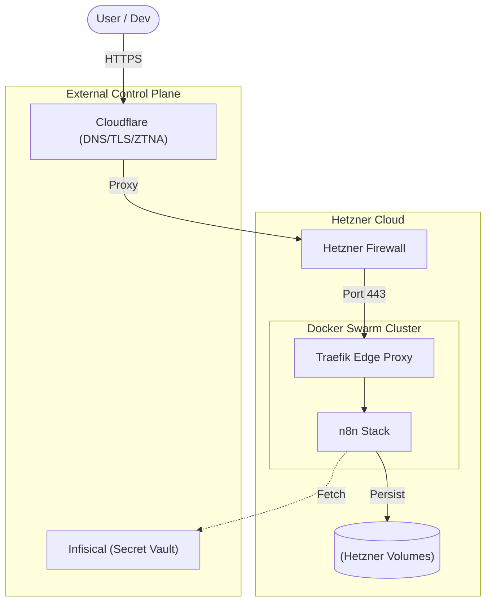
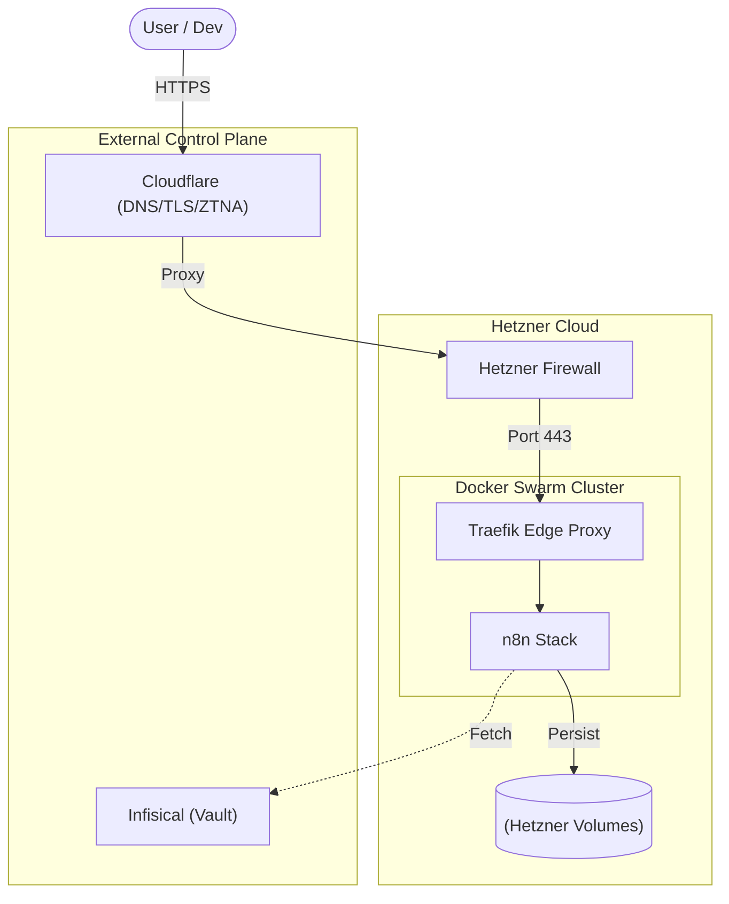
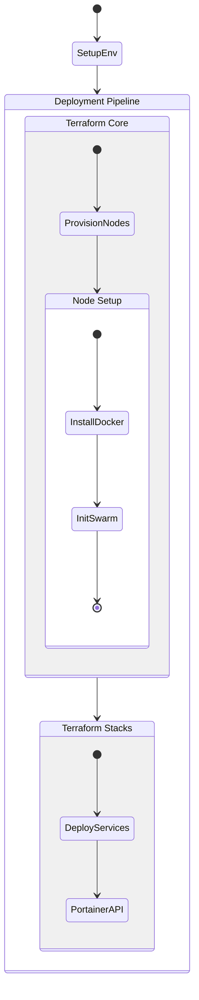

# N8N Infrastructure Architecture

## 📋 Overview

Infrastructure as Code (IaC) for deploying n8n on Hetzner Cloud using:
- **Terraform** - Infrastructure provisioning
- **Docker Swarm** - Container orchestration
- **Portainer** - Web interface for stack management
- **Container-first** - All services in containers (PostgreSQL, Redis, n8n)

---

## 🏗️ Current Architecture (Cluster v1.0)

### System Context


---

```
┌────────────────────────────────────────────────────────────────────────────────┐
│                            Hetzner Cloud (fsn1)                                │
│                                                                                │
│  ┌──────────────────────────────────────────────────────────────────────────┐  │
│  │  Network: network-1 (10.0.1.0/24)                                        │  │
│  │                                                                          │  │
│  │  ┌──────────────────────────────┐      ┌──────────────────────────────┐  │  │
│  │  │      eu-manager-01           │      │        eu-data-01            │  │  │
│  │  │  (CX23: 2vCPU / 4GB)         │      │     (CX23: 2vCPU / 4GB)      │  │  │
│  │  ├──────────────────────────────┤      ├──────────────────────────────┤  │  │
│  │  │ Role: Swarm Manager (Leader) │      │ Role: Swarm Worker (Data)    │  │  │
│  │  │                              │      │                              │  │  │
│  │  │ Services:                    │      │ Services:                    │  │  │
│  │  │ - Traefik (Edge Proxy)       │      │ - n8n-redis (Queue)          │  │  │
│  │  │ - Portainer (Management)     │      │ - tools_db-postgres (DB)     │  │  │
│  │  │ - n8n-main (Web UI)          │      │                              │  │  │
│  │  │ - n8n-worker (Executor)      │      │                              │  │  │
│  │  │                              │      │                              │  │  │
│  │  │ IP: 10.0.1.10                │      │ IP: 10.0.1.20                │  │  │
│  │  │ Storage:                     │      │ Storage:                     │  │  │
│  │  │ - GlusterFS Client           │      │ - GlusterFS Brick            │  │  │
│  │  │ - Mount: /mnt/storage-pool   │      │ - Mount: /mnt/storage-pool   │  │  │
│  │  │                              │      │ - Mount: /mnt/postgres-data  │  │  │
│  │  └──────────────────────────────┘      └──────────────────────────────┘  │  │
│  └──────────────────────────────────────────────────────────────────────────┘  │
│                                                                                │
│  Security Layer:                                                               │
│  └─ cluster-public-firewall: SSH (Admin), HTTP (80), HTTPS (443), ICMP         │
└────────────────────────────────────────────────────────────────────────────────┘
```

### Container Structure (By Node)

```text
Docker Swarm Cluster
├── eu-manager-01 (Manager)
│   ├── traefik_traefik       (Edge Proxy & SSL)
│   ├── portainer_portainer   (Management UI)
│   ├── n8n_n8n-main          (n8n Web UI + Webhooks)
│   └── n8n_n8n-worker        (n8n Workflow Execution)
└── eu-data-01 (Data)
    ├── tools_db_postgres     (Shared Database PG 16)
    └── n8n_redis             (n8n Cache/Queue)
```

### Volume Management

We use a hybrid storage model combining local block storage and shared GlusterFS:

```
/mnt/storage-pool/             # Shared GlusterFS (Hetzner Volume 10GB)
├─ traefik/                    # SSL certificates and logs
├─ portainer/                  # Portainer configuration and data
└─ n8n/                        # n8n shared files (.n8n, nodes, cache)

/mnt/postgres-data/            # Dedicated DB Storage (Hetzner Volume 10GB)
└─ pgdata/                     # PostgreSQL binary data
```

---

## 🏗️ Design & Architecture

### System Context


### Design Decisions & Rationale

| Decision | Selection | Rationale |
|----------|-----------|-----------|
| **Cloud Provider** | Hetzner Cloud | Exceptional performance/price ratio and robust API for Terraform. |
| **Orchestrator** | Docker Swarm | Lower overhead than Kubernetes; native secret management and easy horizontal scaling. |
| **Secret Management** | Infisical | Centralized vault preventing "secret leakage" in git and providing versioned environment. |
| **Edge Proxy** | Traefik v3 | Native Swarm support with dynamic service discovery and automated SSL. |
| **Bootstrapping** | Cloud-init | Ensures that every node is "born" with Docker, security, and Swarm roles already configured. |

---

## 🔐 Security Architecture

### 1. Defense in Depth
The core security premise is **Edge-First Protection**:
- **Trusted Internal Network**: All inter-service communication flows over an isolated VPC (10.0.1.0/24).
- **Perimeter Defense**: Strict enforcement at the **Edge** (Cloudflare + Traefik).
- **ZTNA**: We leverage **Cloudflare Access** for identity-aware proxying to internal tools (Portainer).

### 2. Network Segmentation
- **Overlay Networks**: Services communicate over dedicated Docker overlay networks (e.g., `traefik_public`, `internal_network`).
- **External Firewall**: Drops all traffic except ports 80, 443, and whitelisted SSH IPs.

### 3. SSH Hardening
We follow the "Zero Trust" model for host access:
- **Key-Based Auth Only**: Passwords and root login are disabled.
- **MaxAuthTries**: Hardened at the OS level (`MaxAuthTries 3`).

### 4. Compliance & Audit
- **Traefik Access Logs**: Centralized ingress tracking.
- **Bootstrapping Audit**: Managed via `/var/log/cloud-init-complete.log`.
- **Secret Flow Audit**: Infisical access logs track all machine identity requests.

---

## 🤖 Bootstrapping Logic

The deployment process is fully automated via **Cloud-init**, following this state flow:



---

## 📊 Resource Allocation Scenarios

### Scenario A: Single Node (Low Cost / Dev)
Everything running on a single CX23 (2 vCPU, 4GB RAM) instance. Non-HA.

| Service | CPU Limit | Memory Limit | Role |
|---------|-----------|--------------|------|
| n8n-main | 0.5 CPU | 1024MB | Web UI + Webhooks |
| n8n-worker | 0.8 CPU | 1536MB | Workflow execution |
| n8n-postgres | 0.5 CPU | 1024MB | n8n database |
| n8n-redis | 0.2 CPU | 256MB | Queue backend |
| **Total** | **~2.0 CPU** | **~3.8GB** | *Tight fit (CX23)* |

---

### Scenario B: 2-Node Setup (Current / Recommended)
Separation of concerns. Better stability for both n8n and Postgres.

| Node | Service | CPU Limit | Memory Limit |
|------|---------|-----------|--------------|
| **eu-manager-01** | n8n-main | 0.8 CPU | 1536MB |
| (CX23: 2v/4G) | n8n-worker | 0.8 CPU | 1280MB |
| | Traefik | 0.4 CPU | 256MB |
| | Portainer | 0.5 CPU | 512MB |
| **eu-data-01** | n8n-postgres | 1.2 CPU | 2560MB |
| (CX23: 2v/4G) | n8n-redis | 0.3 CPU | 512MB |

---

### Scenario C: 5-Node Cluster (High Availability)
Full redundancy and specialized roles for production loads.

| Node Type | Count | Services | Rationale |
|-----------|-------|----------|-----------|
| **Managers** | 2 | Swarm Control, Traefik, Portainer | Quorum and entry point redundancy. |
| **Workers** | 2 | n8n-main, n8n-worker | Scalable workflow execution. |
| **Data** | 1 | PostgreSQL, Redis | Dedicated high-perf data persistence. |

---

## 🛠️ Troubleshooting

For solutions to common issues, see: **→ [docs/TROUBLESHOOTING.md](TROUBLESHOOTING.md)**

---

## 📦 Container Images

| Service | Image | Version Strategy |
|---------|-------|------------------|
| n8n | `n8nio/n8n` | `2.4.8` |
| PostgreSQL | `postgres` | `16-alpine` |
| Redis | `redis` | `7.2-alpine` |
| Traefik | `traefik` | `v3.6.7` |
| Portainer | `portainer/portainer-ce` | `2.33.0` |

---

## 🔮 Future Roadmap

### Monitoring (Grafana LGTM Cloud)
Planned integration with **Grafana LGTM Cloud Stack** (Loki, Grafana, Tempo, Mimir) for premium observability:
- Centralized log aggregation via Loki.
- Metric visualization and dashboards via Grafana Cloud.
- No local infrastructure overhead.

### Backup Strategy (Restic)
Implementation of **Restic** for managed backups to offsite storage (Cloudflare R2 or AWS S3).

---

## 📈 Scaling Strategy

### n8n Webhooks (Horizontal)
```bash
docker service scale n8n_n8n-main=3
```

### Vertical Scaling (Resize)
Update `server_type` in Terraform and apply (requires downtime).

---

## 🔗 References

- **Terraform:** [Hetzner Cloud Provider](https://registry.terraform.io/providers/hetznercloud/hcloud/latest/docs)
- **Docker Swarm:** [Docker Swarm Mode](https://docs.docker.com/engine/swarm/)
- **Portainer:** [Portainer Documentation](https://docs.portainer.io/)
- **n8n:** [n8n Self-Hosting](https://docs.n8n.io/hosting/)

---

## 📝 Version History

| Version | Date | Changes |
|---------|------|---------|
| 1.0 | 2026-01-31 | Initial version (Standardized repository structure) |
