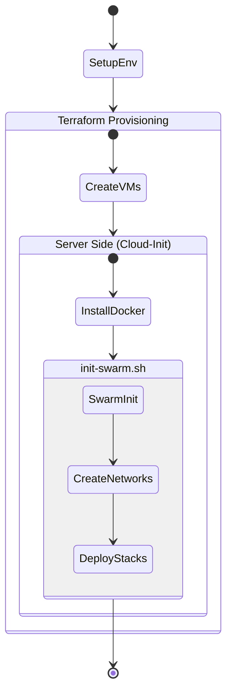

# 🔧 Utility Scripts

This directory contains automation scripts to facilitate the setup, maintenance, and troubleshooting of the infrastructure.

## 📜 Script List

### 🛠️ Setup & Environment

#### `setup-env.sh`
Configures the local environment for development and operation.
- Creates the `.env` file based on `.env.example`.
- Configures initial permissions.
- **Usage:** `./scripts/setup-env.sh`

### 🤖 Cluster Automation (Cloud-Init)

These scripts are generally executed automatically by `cloud-init` during server provisioning but can be used for manual repair.

#### `init-swarm.sh`
Initializes the first Manager node of the Docker Swarm cluster.
- Defines node Labels.
- Creates Overlay networks (`traefik_public`, `agent_network`).
- Performs the initial deploy of essential stacks (Portainer, Traefik).
- **Execution:** Automatic on the first Manager.

#### `join-swarm.sh`
Script for new nodes to join the cluster.
- Obtains the Swarm token via Infisical or parameter.
- Executes `docker swarm join`.
- **Execution:** Automatic on Workers and secondary Managers.

#### `swarm-label-node.sh`
Applies labels and metadata to Swarm nodes to ensure containers run on the correct servers (Placement Constraints).
- Example: Marking a node as `role=worker` or `type=high-cpu`.

## 🔄 Bootstrapping Diagram

## 📝 Version History

| Version | Date | Changes |
|---------|------|---------|
| 1.0 | 2026-01-31 | Initial version |
