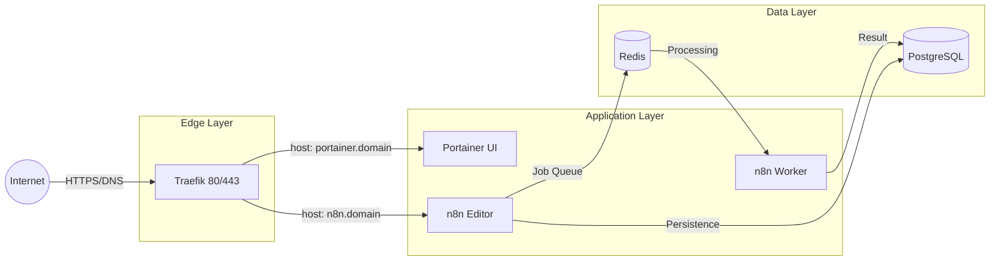

# 🚢 Services & Stacks

This directory contains the definitions of the services running in the Docker Swarm cluster.

## 📋 Overview

The architecture is based on containerized microservices, organized into Docker Swarm "Stacks".

### Core Services

| Service | Directory | Description |
|---------|-----------|-----------|
| **Traefik** | `traefik/` | Reverse Proxy, Load Balancer, and SSL Certificate Management. |
| **Portainer** | `portainer/` | Web interface for visual management of the Swarm cluster. |
| **tools_db** | `tools_db/` | Shared PostgreSQL persistence layer. |
| **n8n** | `n8n/` | Main automation stack (Main + Workers + Redis). |

## 🔄 Request Flow



## 🛠️ Stack Deployment

Stacks are managed via Terraform and Portainer, but can be updated manually:

```bash
# Example: Redeploy n8n
docker stack deploy -c services/n8n/docker-compose.yaml n8n
```

## 🌐 Networks (Overlay Networks)

- **traefik_public**: External network for public ingress.
- **internal_network**: Isolated network for inter-service communication (DB/Redis).

---
## 📝 Version History

| Version | Date | Changes |
|---------|------|---------|
| 1.1 | 2026-02-11 | Added tools_db stack and refined network descriptions |
| 1.0 | 2026-01-31 | Initial version |
