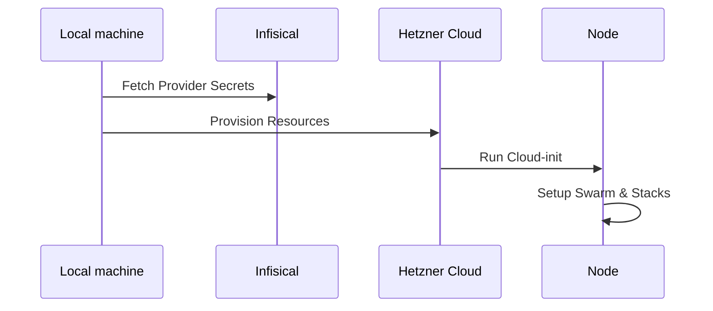

# 🏗️ Infrastructure as Code (Terraform)

This directory contains the declarative definition of the infrastructure on Hetzner Cloud and Cloudflare.

## 📋 Overview

The project uses Terraform to provision:
- **Networking**: Isolated Private Network (VLAN).
- **Security**: Firewalls with dynamic IP whitelisting.
- **Compute**: CX23 Manager and Data nodes.
- **Storage**: Hetzner Volumes for Postgres and GlusterFS.
- **DNS**: Cloudflare records and Zero Trust Access.
- **Secrets**: Dynamic fetching from Infisical.

## 📂 File Structure

| File | Description |
|------|-------------|
| `main.tf` | Provider and Backend configuration. |
| `versions.tf` | Versioning and R2 Backend setup. |
| `variables.tf` | Variables and Infisical secret mapping. |
| `htz-*.tf` | Hetzner specific resources (Network, Firewall, Servers). |
| `cf-*.tf` | Cloudflare specific resources (DNS, Access). |
| `cloud-init.tftpl` | Bootstrap template for new nodes. |

## 🚀 Deployment Flow

## 🔐 State Management
State is stored securely in **Cloudflare R2** with locking support.

---
## 📝 Version History

| Version | Date | Changes |
|---------|------|---------|
| 1.0 | 2026-01-31 | Initial version |
