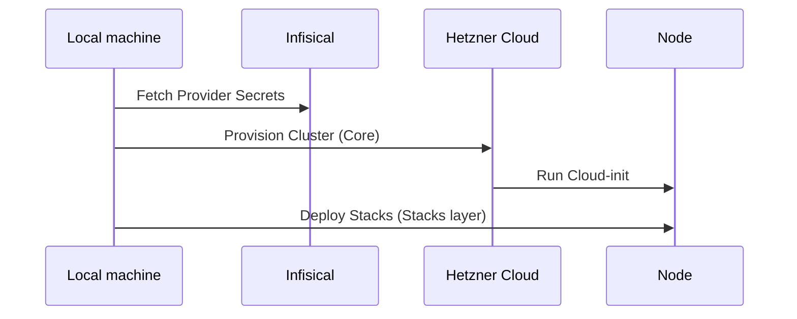

# 🏗️ Infrastructure as Code (Terraform)

This directory contains the declarative definition of the infrastructure on Hetzner Cloud and Cloudflare.

> [!WARNING]
> **Custom Portainer Provider Required**: This project uses a custom-patched version of the [Portainer Terraform Provider](https://github.com/portainer/terraform-provider-portainer) to support Cloudflare Access headers. 
> 
> Because we are using a locally patched binary, the `.terraform.lock.hcl` file is ignored to prevent checksum mismatches. Until the fix is merged upstream, you must use a patched binary to avoid `invalid character '<'` (Cloudflare blocking API requests) errors.

## 📋 Overview

The project uses Terraform to provision:
- **Networking**: Isolated Private Network (VLAN).
- **Security**: Firewalls with dynamic IP whitelisting.
- **Compute**: CX23 Manager and Data nodes.
- **Storage**: Hetzner Volumes for Postgres and GlusterFS.
- **DNS**: Cloudflare records and Zero Trust Access.
- **Stacks Orchestration**: Automated deployment of Docker services via Portainer (decoupled layer).
- **Secrets**: Dynamic fetching from Infisical.

## 📂 File Structure

| File | Description |
|------|-------------|
| `main.tf` | Provider and Backend configuration. |
| `versions.tf` | Versioning and R2 Backend setup. |
| `variables.tf` | Variables and Infisical secret mapping. |
| `htz-*.tf` | Hetzner specific resources (Network, Firewall, Servers). |
| `cf-*.tf` | Cloudflare specific resources (DNS, Access). |
| `cloud-init.tftpl` | Bootstrap template for new nodes. |
| `stacks/` | **Decoupled Stack Layer**: Manages n8n and database services. |

## 🚀 Deployment Flow

## 🏗️ Core vs Stacks Decoupling
We split the Terraform configuration into two distinct layers:
1. **Core (Root)**: Dedicated to the hardware and networking. This layer changes slowly and maintains cluster stability.
2. **Stacks (`/stacks`)**: Dedicated to the application logic. This layer interacts with the Portainer API and can be updated frequently without risking the underlying infrastructure.

## 🔐 State Management
State is stored securely in **Cloudflare R2** with locking support.

---
## 📝 Version History

| Version | Date | Changes |
|---------|------|---------|
| 1.0 | 2026-01-31 | Initial version |
